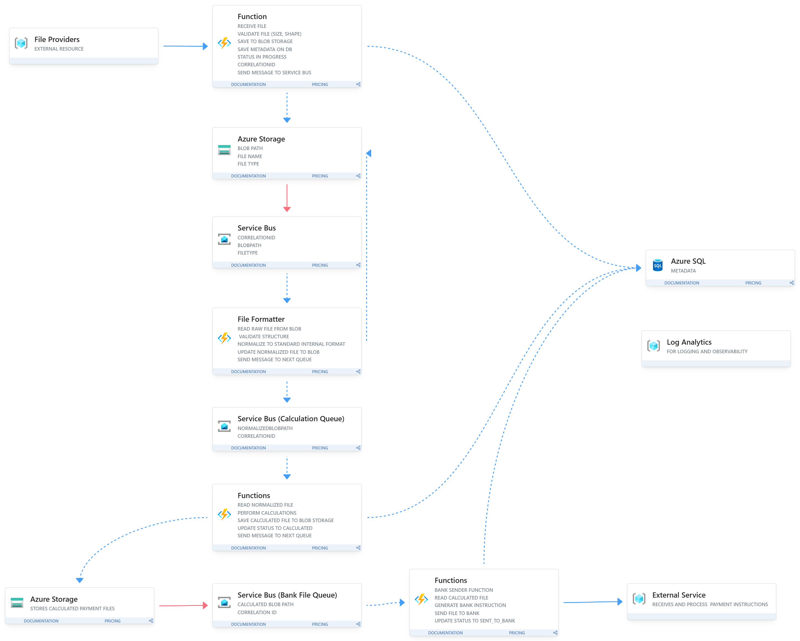

# Case Study - Payroll System

## Overview

A payment processing system that receives files from various resources, validates and processes them, and sends instruction files to banks to execute actual payments.

**Key Characteristics:**
- Fully automatic system
- No user interface

---

## Functional Requirements

### File Processing
- Receive files to be processed
- Validate and process the files
- Work with various file formats
- Perform various calculations on the file data

### Payment Execution
- Create bank payment files
- Put the payment file in a designated folder

### Audit and Compliance
- Keep log of all activity for 7 years

---

## Non-Functional Requirements

### Performance and Volume
- **Throughput**: 500 files per day
- **Processing time**: 1 minute per file
- **File size**: Average 1MB per file
- **Daily data volume**: 500MB per day

### Reliability
- **Data loss tolerance**: Absolutely no data loss allowed
- **System availability**: Must be highly reliable for payment processing

### Storage and Retention
- **Activity log retention**: 7 years
- **Total storage estimate**: 2TB over 7 years

### Integration
- **Customer impact**: No changes should be made at customer side (backward compatibility required)

---

## Technical Specifications

### Volume Calculations
- 1 file = 1MB
- 500 files/day = 500MB/day
- Annual storage: ~180GB/year
- 7-year storage: ~1.26TB (excluding logs and metadata)

---

## Key Considerations

### Data Reliability
- Zero tolerance for data loss
- Must ensure all files are processed successfully
- Requires robust error handling and retry mechanisms

### Audit Requirements
- Complete activity logging for 7 years
- Must track all file processing activities
- Compliance with financial regulations

---

---

## Architecture Reasoning

### Azure Function (File Receiver)

Used as the entry point for incoming files. It receives files from external providers, performs basic validation such as file size and format, stores the raw file in Azure Storage, saves metadata and processing status in Azure SQL, and sends a message to Service Bus to trigger downstream processing.

### Why Azure Functions instead of App Service

Azure Functions were chosen because the system is fully automatic and event-driven. Processing only happens when files are received or when queue messages are triggered. There is no user interface and no need to keep an application server running continuously. This makes it more cost-efficient and reduces operational overhead compared to App Service.

### Tradeoff (Azure Functions)

Azure Functions can experience cold starts after periods of inactivity. This is acceptable for this system because the requirement is to process files within one minute, not instant response. Since the system is queue-based, small delays do not impact the overall processing flow.

### Azure Storage (File Storage)

Used to store both raw input files and processed output files. It ensures that files are safely persisted before and after each processing stage. It also avoids passing large file contents through queues, which improves efficiency and keeps services loosely coupled.

### Azure SQL (Metadata and Status Tracking)

Used to store file metadata, correlation IDs, and processing status. It provides a structured way to track each file throughout the entire processing pipeline.

### Service Bus (Messaging)

Used to connect different stages of the pipeline. It ensures reliable message delivery between components and supports retries and failure handling. This is important because the system cannot tolerate data loss.

### Why Service Bus instead of a simpler queue

Service Bus was chosen because it provides stronger reliability features such as retries and dead-lettering. These are important for financial systems where every message must be processed safely.

### File Formatter Function

Used to validate and normalize incoming files into a standard internal format. This simplifies downstream processing by ensuring that all files follow the same structure.

### Calculation Function

Used to perform business logic and calculations on normalized data. It reads the processed file, applies required computations, stores the results, updates the status, and triggers the next step in the pipeline.

### Bank Sender Function

Used to generate bank instruction files and send them to the external banking system. This separates bank-specific logic from earlier processing stages and keeps the processing pipeline modular.
