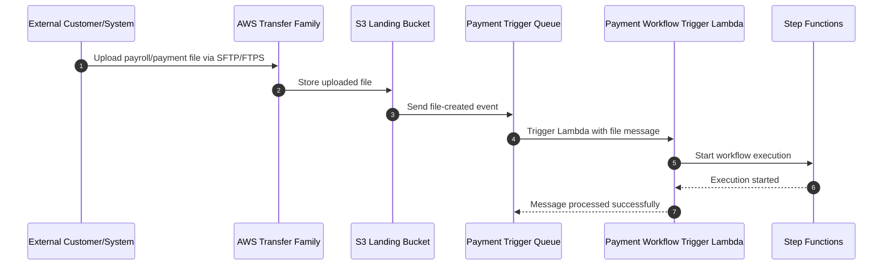
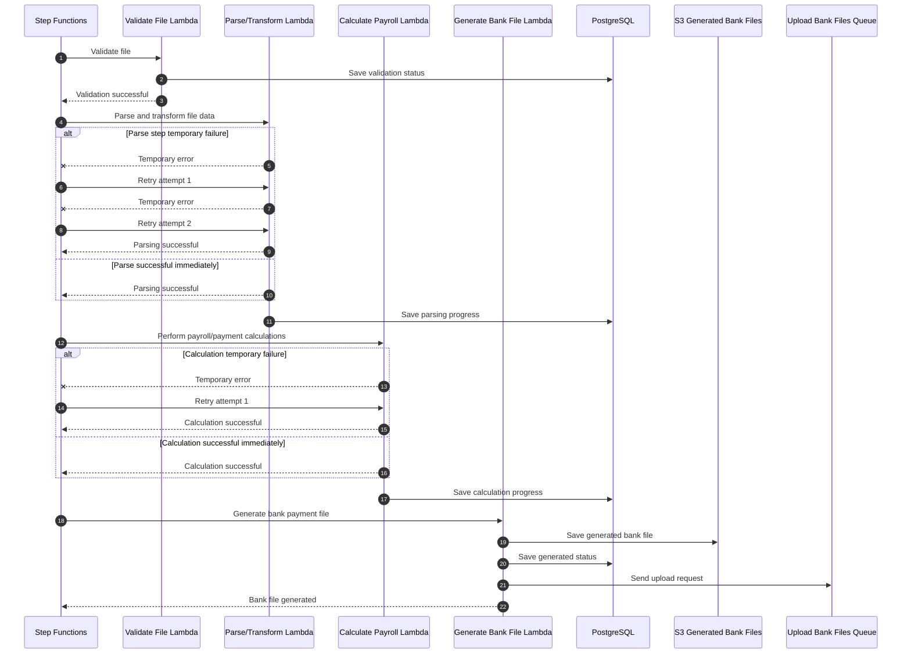
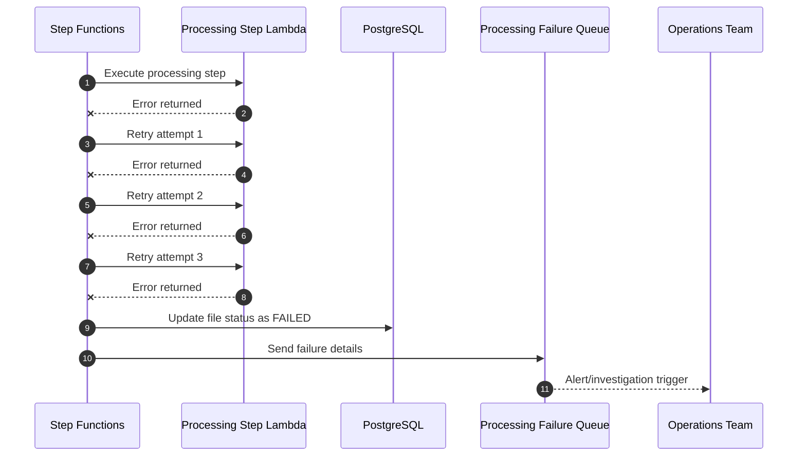
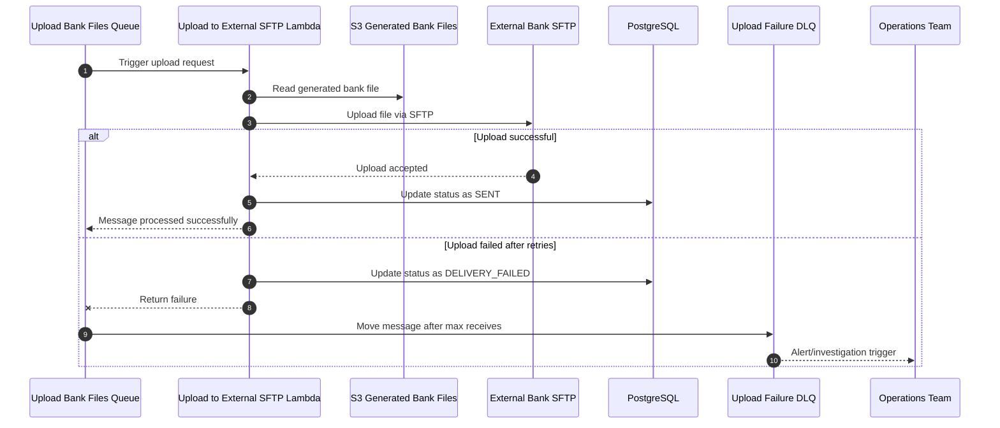

# Case Study - Payroll System

## Overview

A payment processing system that receives files from various resources, validates and processes them, and sends instruction files to banks to execute actual payments.

**Key Characteristics:**
- Fully automatic system
- No user interface

---

## Functional Requirements

### File Processing
- Receive files to be processed
- Validate and process the files
- Work with various file formats
- Perform various calculations on the file data

### Payment Execution
- Create bank payment files
- Put the payment file in a designated folder

### Audit and Compliance
- Keep log of all activity for 7 years

---

## Non-Functional Requirements

### Performance and Volume
- **Throughput**: 500 files per day
- **Processing time**: 1 minute per file
- **File size**: Average 1MB per file
- **Daily data volume**: 500MB per day

### Reliability
- **Data loss tolerance**: Absolutely no data loss allowed
- **System availability**: Must be highly reliable for payment processing

### Storage and Retention
- **Activity log retention**: 7 years
- **Total storage estimate**: 2TB over 7 years

### Integration
- **Customer impact**: No changes should be made at customer side (backward compatibility required)

---

## Technical Specifications

### Volume Calculations
- 1 file = 1MB
- 500 files/day = 500MB/day
- Annual storage: ~180GB/year
- 7-year storage: ~1.26TB (excluding logs and metadata)

---

## Key Considerations

### Data Reliability
- Zero tolerance for data loss
- Must ensure all files are processed successfully
- Requires robust error handling and retry mechanisms

### Audit Requirements
- Complete activity logging for 7 years
- Must track all file processing activities
- Compliance with financial regulations

---


---

# Architecture Reasoning

## Overview

This system receives payroll/payment files from external sources, validates and processes them, generates bank payment instruction files, and uploads those files to an external bank SFTP service.


## 1. Why AWS Transfer Family to S3?

The requirement says there should be no customer-side changes.

Because this is a file-based payment system, external customers or systems are likely already sending files using SFTP or FTPS.

AWS Transfer Family allows us to preserve the same file transfer protocol

```text
Customer keeps using SFTP/FTPS
AWS stores uploaded files in S3
Internal processing starts from S3
```

S3 is used as the landing storage because it is durable, scalable, and suitable for retaining original files for audit and reprocessing.

---

## 2. Why SQS Before the Payment Workflow Trigger?

SQS is used between S3 and the workflow trigger to decouple file upload from file processing.

```text
S3 Upload
   ↓
SQS Queue
   ↓
Lambda Trigger
   ↓
Step Functions
```

This gives the system:

- Buffering
- Retry control
- Better failure handling
- DLQ support
- Protection from temporary Lambda or Step Functions issues

If the workflow trigger fails, the message can be retried. If it still fails after multiple attempts, it can go to a trigger DLQ.

This prevents uploaded files from being missed.

---

## 3. Step Functions Retry and Failure Handling

Each processing step inside Step Functions can have its own retry and catch logic.

Example:

```text
Validate File
   ↓
Parse / Transform
   ↓
Calculate Payroll
   ↓
Generate Bank File
   ↓
Return Result
```

If a step fails:

```text
Step failed
   ↓
Retry x times
   ↓
Still failed
   ↓
Catch error
   ↓
Send failure details to processing failure queue
   ↓
Update status as FAILED
   ↓
Keep original file in S3 for reprocessing
```

The original file is not lost because it remains stored in S3.

The failure queue contains metadata such as:

```text
file id
S3 bucket/key
failed step
error reason
timestamp
```

This allows to investigate and reprocess the file if needed.

---

## 4. Why Step Functions?

Step Functions is used because payment processing is a workflow with multiple ordered steps.

It is better than chaining many Lambda-to-queue-to-Lambda stages because Step Functions provides a clear view of the full process.

Benefits:

- Clear workflow orchestration
- Retry per step
- Catch/failure handling per step
- Easier troubleshooting
- Easier audit trail
- Better visibility of where the process failed

This is important for payment systems because the system must clearly track whether a file was validated, processed, generated, failed, or sent.

---

## 5. Why Queue Before Uploading to External SFTP?

Generated bank files are placed in S3 first, then sent to an upload queue.

```text
Generated Bank File
   ↓
S3
   ↓
SQS Upload Queue
   ↓
Upload Lambda
   ↓
External Bank SFTP
```

The queue is useful because external SFTP services can fail or become unavailable.

Common issues include:

- Bank SFTP downtime
- Network timeout
- Authentication issue
- Temporary connection failure

With SQS, the system can retry the upload safely.

If the upload still fails after multiple attempts, the message can go to an upload failure DLQ for operations support.

This helps ensure bank files are not silently lost.

---

## 6. Why Lambda Over Container?

Lambda is a good fit for this system because the workload is event-driven and relatively small.

Based on the requirements:

- 500 files per day
- Average 1MB file size
- Around 1 minute processing time per file
- No user interface
- Fully automatic workflow

Lambda fits well because it only runs when there is work to do.

Benefits:

- No server management
- Automatic scaling
- Cost-effective for low to moderate volume
- Good integration with S3, SQS, and Step Functions
- Simpler operational overhead

A container-based service such as ECS would be more appropriate if the system needed long-running processing, heavy CPU usage, large file processing, custom runtime dependencies, or always-on workers.

For this case, Lambda is simpler and sufficient.

---

## Summary

This architecture uses AWS managed services to create a reliable file-based payment processing system.

Key decisions:

- AWS Transfer Family preserves existing SFTP/FTPS integrations.
- S3 stores original and generated files durably.
- SQS provides buffering, retries, and DLQ support.
- Step Functions orchestrates the payment workflow.
- Lambda is used for event-driven processing.
- Failure queues support operational investigation and reprocessing.
- PostgreSQL stores metadata, processing progress, and delivery status.

# Sequence Diagrams

## 1. File Ingestion Sequence



---

## 2. Payment Processing Success Sequence



---

## 3. Payment Processing Failure Sequence



---

## 4. Bank SFTP Upload Sequence



---
```
